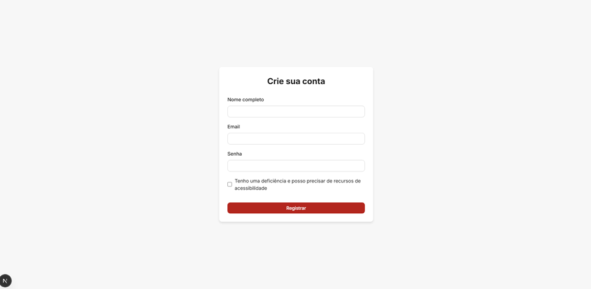
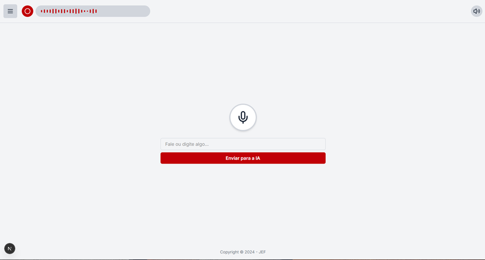
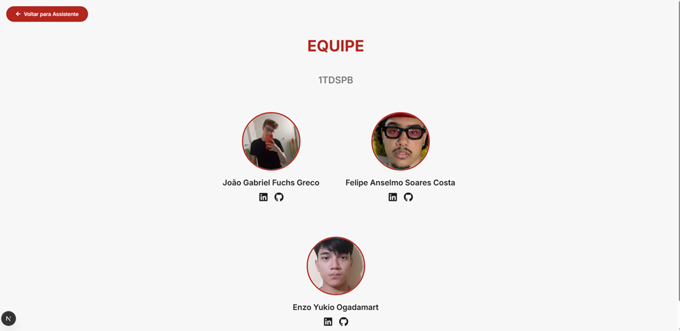

# 🎧 Interface de Acessibilidade para Usuários de Metrôs e Trens da CCR com Deficiência Visual

## 📌 Requisitos para Rodar o Projeto

Caso as dependências não venham ao clonar o projeto, execute os seguintes comandos no terminal para instalá-las:

```bash
npm install
npm install lucide-react
npm install react-icons
```

## -----------------------------------------------------------------------

## 1 - Tela de registro


## 2 - Tela principal com assistente

Clique no microfone para falar, em seguida, aceite a permissão do navegador
Fale ou digite no campo de texto e, a IA irá responder tanto em texto quanto em voz.



## 3 - Tela de equipe

